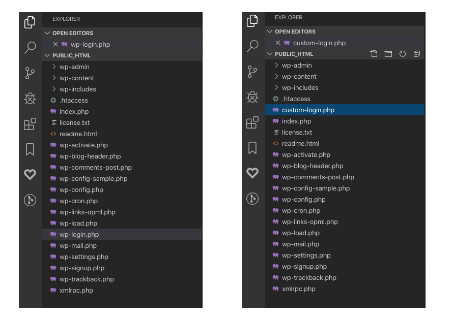

Hi, here is a quick tip on how to create custom login url on your WordPress. Before we start I would like to point out that you would need access to the file system, whether that is on the server or locally.

Let’s start, the first thing we need to do is change default login url that WordPress points to when somebody wants to enter wp-admin and is not logged in. Bots usually try to access the login page by going to wp-admin directly. For that, we can use a hook that filters login url. We also want to change logout url, where a user should be redirected on logout.

```php
class Login {
  /**
  * Register all the hooks
  *
  * @return void
  *
  * @since 1.0.0
  */ 
  public function register() {
    add_filter( 'login_url', [ $this, 'custom_login_url' ], 10, 3 );
    add_filter( 'logout_url', [ $this, 'custom_logout_url' ], 10, 3 );
}
...}
```

In our callback function, we can return any url that we want, just to point out all callbacks for filters need to be public. In this example snippet we use home url, so each time someone not logged in tries to access wp-admin, WordPress will redirect him to home url.

```php
public function custom_login_url( string $login_url, string $redirect, bool $force_reauth ) : string {
   return \home_url( '/' );
}
```

For logout we use the name of our custom-login.php file, we don’t need to hide url from already logged in users.

```php
public function custom_logout_url( string $logout_url, string $redirect ) : string {
   return \home_url( '/custom-login.php' );
}
```

Now we can change the name of the wp-login.php file from WordPress root to any custom name, in this example we are going to name it custom-login.php. The last thing is to change all references to the wp-login.php inside of the file to your custom-login.php.



Wp-login.php is a form when the user enters login information, that information is submitted to the same file. So if we would not rename reference to wp-login.php, all user information would be submitted to the file we just renamed and it does not exist anymore.

That is it, now you have our new login url. From here you could add redirection to remove .php from url, eather through a plugin or by checking for url on 404 pages.

Until next time, happy coding.