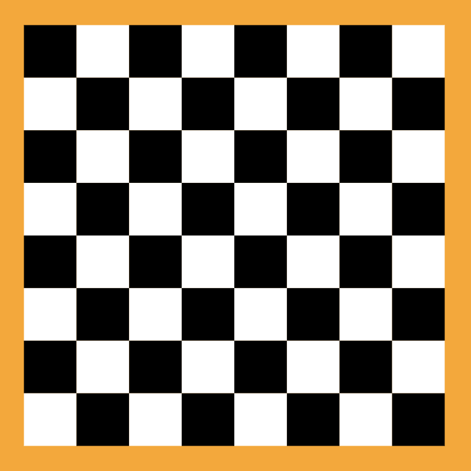
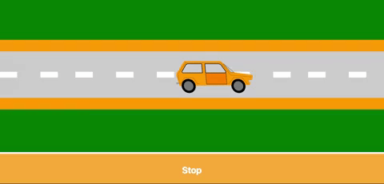

We already know the strength of svelte, of fully reactive small bundles and fast code. And although it can do a lot, like SSR with Sapper or mobile with Svelte Native. I am most excited about possibilities to use it for SVG and canvas manipulation. For example, to animate an SVG stroke, we just need to call a draw function from Svelte animate module. Also, the idea of using it with Three.js or Babylon with project [Svelte Gl](https://github.com/Rich-Harris/svelte-gl) is awesome and I am really hopeful for the project.

```javascript
import { draw } from 'svelte/transition';
import { quintOut } from 'svelte/easing';

<svg viewBox="0 0 5 5" xmlns="http://www.w3.org/2000/svg">
	{#if condition}
		<path transition:draw="{{duration: 5000, delay: 500, easing: quintOut}}"
					d="M2 1 h1 v1 h1 v1 h-1 v1 h-1 v-1 h-1 v-1 h1 z"
					fill="none"
					stroke="cornflowerblue"
					stroke-width="0.1px"
					stroke-linejoin="round"
		/>
	{/if}
</svg>
```

Manipulating SVG can be a tedious process. That is why we use libraries like [D3](https://d3js.org/) to help us out, this is not a replacement for D3, quite the opposite, Svelte with D3 is a really powerful combination. I hope to write an article about it in the future. In this article, we will explore how we can use Svelte to draw SVG patters, animate and morph path. So let's begin.

## Components

In the first example, we will be creating a Checkerboard SVG component. We will use loops to create pattern of black and white squares.



In this example, we create squares and with properties that we can define from the parent component. From squares property using reactive declaration, to be able to change squares number from parent dynamically, we generate array of in this example 8 items. This will represent a number of squares on both x and y coordinates.

```javascript
export let squares = 8;
export let  width = 400;
	
$: fields = [...Array(squares)];
	
function getEven(i, j) {
	return ((i + j) % 2) === 0;
}
```

We can see how fields array can be useful, as we are looping twice through an array to generate a 2d matrix grid of squares. On a viewbox property, we add 1 to squares number to create a border, We also use getEven function for alternating between white and black squares.

```javascript
<svg width="{width}px" height="{width}px" viewbox="0 0 {squares + 1} {squares + 1}">
	<rect class="board" width="100%" height="100%" fill="orange"/>
	{#each fields as item, i}
		{#each fields as item, j}
			<rect
				class={getEven(i, j) ? 'white' : 'black'}
				x={i + 0.5}
				y={j + 0.5}
				width="1"
				height="1"
			/>
		{/each}
	{/each}
</svg>
```

In the end, all we need to do is to instantiate the component.

```javascript
<script>
	import Chessboard from './Chessboard.svelte';
</script>

<Chessboard squares={8} />
```

## Animating

Svelte compiles all files into one. So we can mix the Svelte components inside SVG tags. That gives us options to separate parts of SVG. In this example, we will create a car driving on the road.

<SandboxBlock title="Roadtrip" src="https://glitch.com/embed/#!/embed/svelte-roadtrip-animation?path=src/components/app.html&previewSize=50&sidebarCollapsed=true" />

There are 2 SVG components CarSymbols that have car SVG code and RoadPattern with 4 properties, that we can change. Id, width, and height are self-explanatory, while patternTransform is used to animate road.  patternTransform is a transform property for pattern tag in SVG, accepts the same as transform property od SVG or style.


```javascript
export let patternTransform = '';
export let id = 'road';
export let width = '10%';
export let height = '100%';
```

In the App file, we import both components and use request animation frame to loop. To create an animation we just pass changed transform value to the child component of the road pattern to update position of the pattern. Working example

```javascript
function drive() {
  if(carDriving) {
    miles = miles + 1;
    setTimeout(() => {
      window.requestAnimationFrame(drive);
    }, 50);
  }
}
```

<div className="centered" >
  
  <a href="https://svelte.dev/repl/2aab56cc59614dc28f291a8209249fa8?version=3.14.1">Source Code</a>
</div>

## SVG Path

If we want to morph SVG paths, and we don't need a full animation library like [AnimeJs](https://animejs.com/) or [GSAP](https://greensock.com/gsap/) that have their own plugins for manipulation paths. We can use a morphing library like [Flubber](https://github.com/veltman/flubber) or [Polymorph](https://github.com/notoriousb1t/polymorph) which are specialized in path manipulation. Here is an example of how to use Polymorph within Svelte.

<SandboxBlock title="Smile" src="https://glitch.com/embed/#!/embed/svelte-path-morph?path=src/components/app.html&previewSize=30&sidebarCollapsed=true" />

We use the interpolate function from Polymorph, This function takes 2 paths, and returns a function that takes a number between 0 and 1 and returns a timeline. The number represents a position on the timeline, example 0.5 is 50% point. This is perfect to combine with tweened function from Svelte as it interpolates between 2 numbers on some duration. So we use it to animate number from 0 to 1, that we inject in Polymorph timeline.

```javascript
const progress = tweened(0, {
    duration: 600,
    easing: cubicOut
});

onMount(() => {
    morph = interpolate(["#circle", "#square"], { precision: 1 });
    morphMouth = interpolate(["#circle", "#smile"], { precision: 1 });
});
```

Interpolate function needs to be set after Dom has rendered, so we add it to onMount function. Next, all we need to do is add it to the path. As tweened function returns a store, we basically subscribe to it, and tweened will rerender component when data changes. Now every time we change values to the in our example variable progress, it will set morphing animation.

```javascript
<svg viewbox="0 0 50 50" fill="#FBB43E">
	<defs>
		<path id="circle" d="M 0 25 a 25,25 0 1,0 50,0 a 25,25 0 1,0 -50,0" />
		<path id="square" d="M 0 0, V 50, H 50 V 0 Z" />
		<path id="smile" d="M20 38.1883C21.4487 39.6436 23.4541 40.5444 25.6698 40.5444C27.9796 40.5444 30.0607 39.5655 31.521 38C29.5403 38.3522 27.4012 38.5444 25.1698 38.5444C23.3754 38.5444 21.6407 38.4201 20 38.1883Z" />
	</defs>
	<path d="{(morph) && morph($progress)}" />
	<g fill="#FDF3C2">
		<path d="{(morphMouth) && morphMouth($progress)}" />
	</g>
</svg>
```

If you combine all the techniques above, you can easily create raining animation like in bottom example.

<SandboxBlock style={{height: "410px"}} title="Rain" src="https://glitch.com/embed/#!/embed/svelte-rain-animation?path=src/components/app.html&previewSize=100&sidebarCollapsed=true" />

<div className="centered spaced">
  <a href="https://svelte.dev/repl/b01660b90e714334861dd6e0e1faff61?version=3.14.1">Source Code</a>
</div>

Although these were simple examples, this can be a powerful combination for creating feature-rich interactive UX. In future articles, I will try to go into other powerful combination for data visualization with Svelte and D3 library.

That is all for now and until next time, happy coding.