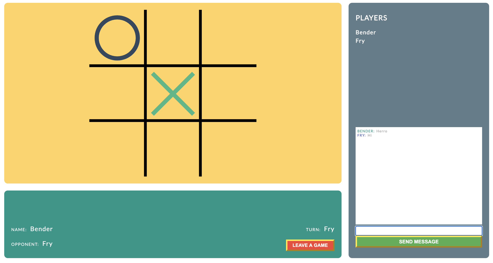

For client side application, HTTP calls are expensive. You can use GraphQL to pool API requests from the front end. Though Websockets are cheaper for high throughput APIs, they use one HTTP connection at the start. After that they behave like [Observables](http://reactivex.io/documentation/observable.html), you can dispatch or subscribe to an event. That is why [Websockets](https://developer.mozilla.org/en-US/docs/Web/API/WebSockets_API) are a the choice for real time apps. For more you can check the [comparison](https://www.educba.com/websocket-vs-rest/) between the two. 

 When you have realtime app, or mostly static server side rendered website the choice is easy. Though what about when you have in between app, you have a lot of calls but do not need real time communication. Well I was working on that kind of app, where we did not need real time communication, though we had a lot of api calls nonetheless. We would benefit from using Websockets, though would that overweight the complexity of implementation.

## Intro

As i was trying to find a small project where i would test the Websockets, Vue 3 beta was released. As project for which Websockets will be tested is a Vue project, i decided to combine these two technologies and see how could they complement each other. So basically project needed to be web app with a lot of calls to server, built with a Vue 3. Eventually i decided it would be a multiplayer game, specifically Tic Tac Toe game. Tic Tac Toe have a simple enough logic to implement and we  could focus on core technologies.

In this article we will explore the implementation of Socket.io, a Websocket library on server side and Vue 3 on client side building a simple real time multiplayer Tic Tac Toe game.

<SandboxBlock style={{width: "100%"}} title="Tic Tac Toe" src="https://codesandbox.io/embed/vue-socket-io-tic-tac-toe-4v644?fontsize=14&hidenavigation=1&module=%2Fsrc%2FApp.vue&theme=dark" permissions={[]} />

## Architecture

Before we start with with code, we need to figure out how the game should work. Tic tac toe is 2 player game, so we need to match 2 player to a single game. We also want a place where all players will be and interact, create and join games. If we explore [mmo games](https://en.wikipedia.org/wiki/Massively_multiplayer_online_game) and how they work, we can see that a lot of games have a lobby. We can use lobby as a place where players go when they first login and to return after the game. In there we can add chat for interaction, and actions for creating or joining the game. We need 3 main screens for the game to function and these are.

1. **Login** - screen where player will enter some name, and after submit player will get id tied to that name so we can track his progress
2. **Lobby** - screen where players will wait until they start a game, whether they will be creating or joining the game, 
3. **Game** - screen where player will play

We also need to keep track of players, for chat or the game, and we need to keep track of the game, as we dont want the game to be available after it has 2 player. For both players and game IDs we can use client IDs that socket gives us when client is connected, as we can use Id of player that created the game for the game. We simply won't allow player to be able to create more that one game at the time.

## Register

At the beginning we show the player login screen, after the player has submitted the name. We need to send that data to the server and create a websocket connection between them. As mentioned at the beginning, for that we need some events. With socket.io after we started socket client,

```javascript
import openSocket from "socket.io-client";

const socketIO = openSocket(port);
```

and server, who is on the port that client opened connection to, also in our case we used express server that comes integrated with socket.io library

```javascript
const socketsIO = require("socket.io")();

socketsIO.on("connection", client => {
// ... we do all our server socket code in here
}
```

We can send player name and get client id for the connection, we call our event registerPlayer. We emit it from a client and listen to it on a server.

```javascript
client.on("registerPlayer", clientName => {
  const playerData = generatePlayerData(client, clientName);

  playersData[client.id] = playerData;

  client.emit("playerData", playerData);
  client.emit("availableGames", availableGames);

  socketsIO.emit("playersData", playersData);
});
```

We store player name and id object in players array, so we can have all players on one place. We sand back to the player his object, and all available games if someone create one before joining. We then send to all players, players data array so every player have information on all players.

## Lobby

When player registers, and goes to the lobby, we need to have 3 main events. For creating game, join a game and for a chat. On chat we simply need to send message from a player to a server, and send that message to all players so they can update their chat. On client we emit chatMessage event. On a server we listen to that event.

```javascript
client.on("chatMessage", message => {
  socketsIO.emit("chatMessage", {
    name: playersData[client.id].name,
    id: playersData[client.id].id,
    message
  });
});
```

Upon receiving them event, server send message along with players name for that message to all players. Where players after receiving chat message update chat view with name and message. For creating a game client sends event createGame.

```javascript
client.on("createGame", () => {
  const gameData = generateGameData(client.id, playersData);

  gamesData[client.id] = gameData;
  availableGames[client.id] = gameData;

  client.emit("gameData", gameData);

  socketsIO.emit("availableGames", availableGames);
});
```

On server we generate game data, assign it with player id and return it to a player. We push game to available game and emit available games to all players, as it has been updated.
After player clicked on one of the available games to join, client emit joinGame event and sends id of the game wishing to join.

```javascript
client.on("gameJoin", player1Id => {
  const gameData = generateGameJoinData(
    gamesData,
    player1Id,
    playersData,
    client.id
  );

  gamesData[player1Id] = gameData;
  delete availableGames[player1Id];

  client.emit("gameData", gameData);

  socketsIO.to(player1Id).emit("gameData", gameData);
  socketsIO.emit("availableGames", availableGames);
});
```

Server upon receiving joinGame event, updated game data with joined player id and name and removes that game from available games. Sends updated game data to both of the players, and updated available games object to all players.

## Game



For the game we need one event, in this case is called gameMove. On the client we send coordinates for the grid, including the new one from the current player.

```javascript
client.on("gameMove", ({ gameId, playerId, data }) => {
  gamesData[gameId].data = data;

  const status = gameStatus(data);

  if (status === GAME_STATUS.WIN) {
    gamesData[gameId].status = {
      name: playersData[playerId].name,
      type: GAME_STATUS.WIN
    };

    socketsIO
      .to(gamesData[gameId].player2.id)
      .emit("gameData", gamesData[gameId]);
    socketsIO
      .to(gamesData[gameId].player1.id)
      .emit("gameData", gamesData[gameId]);

    delete gamesData[gameId];
  } else if (status === GAME_STATUS.TIE) {
    gamesData[gameId].status = {
      type: GAME_STATUS.TIE
    };

    socketsIO
      .to(gamesData[gameId].player2.id)
      .emit("gameData", gamesData[gameId]);
    socketsIO
      .to(gamesData[gameId].player1.id)
      .emit("gameData", gamesData[gameId]);

    delete gamesData[gameId];
  } else {
    gamesData[gameId].onTheMove = generatePlayerOnTheMove(
      gamesData,
      playersData,
      gameId,
      playerId
    );

    socketsIO
      .to(gamesData[gameId].player1.id)
      .emit("gameData", gamesData[gameId]);
    socketsIO
      .to(gamesData[gameId].player2.id)
      .emit("gameData", gamesData[gameId]);
  }
});
```

First we check if there is a end condition. If player have won with the last move or is it a tie. For both win conditions we delete a game from games as it is done and send game data to player playing with appropriate end condition. If we don't have a end condition we just update player on the move with opposite player and send data to both players to continue the game. We continue until there is end condition or one of the players leave the game and for that we have event destroyGame that we listen on the server.

```javascript
client.on("gameDestroy", gameId => {
  delete availableGames[gameId];
  socketsIO.emit("availableGames", availableGames);

  if (
    gamesData[gameId] &&
    gamesData[gameId].player1 &&
    gamesData[gameId].player1.id
  ) {
    socketsIO.to(gamesData[gameId].player1.id).emit("gameData", null);
  }

  if (
    gamesData[gameId] &&
    gamesData[gameId].player2 &&
    gamesData[gameId].player2.id
  ) {
    socketsIO.to(gamesData[gameId].player2.id).emit("gameData", null);
  }

  delete gamesData[gameId];
});
```

Where we just check who left the game and remove game from games array. And here we covered all the event needed for game to function.

## Conclusion

Implementing websockets is really easy and intuitive. Though asking backend team to update existing project with this architecture is a bit much. Websockets are awesome for certain projects, they need to be part of the project from the start. Also it depends on backed technology, as it is really easy to implement it on node, it could a bit tricker using php. I enjoyed working on this little project and see a lot of benefit for websockets, though i was more excited of using Vue 3 and composition api. Using hooks with Vue ads to more cleaner code. Basically almost all of the components could be functional as all the state and logic is in hooks. Some of the issues with composition api is with longer return object from setup function. Though for that you can use object for storing references and then just spread that object on return. For more on that you can read in tha last article or you could just use library [Vue template vars](https://www.npmjs.com/package/vue-template-vars) explained in the article.

Well this was fun, until next time happy coding.