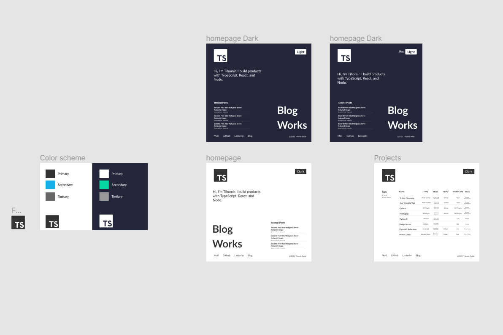
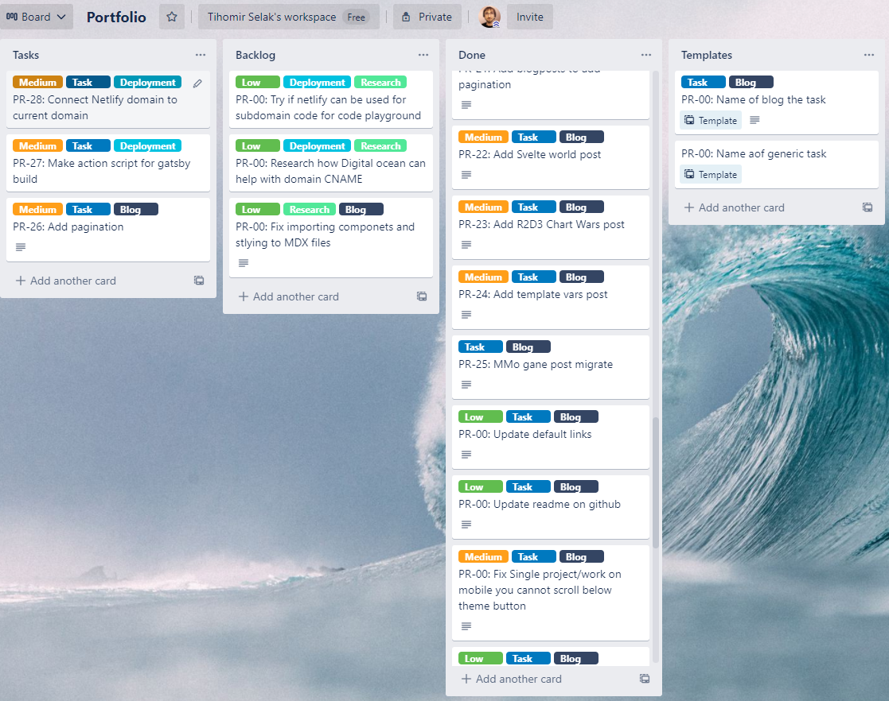

It's been a long time from last article. And now of release of new blog it has been a perfect time to remedy that. In this article I'll try to explain the process of managing project. So this article will be a bit of different one. It is more of explaning the process and decision making than actual code.

## Intro

Let's first explain the backstory of this new blog and the reason why it is here.

My last wesite was on [Digital Ocean](https://www.digitalocean.com/) a very good service for deploying apps. At that time i worked as a [Wordpress](https://wordpress.org/) developer, and technoology stack was React for frontend and PHP for SSR. Local development environment was docker so deploying to [Digital Ocean](https://www.digitalocean.com/) made sense. Also at that time I was switching technologies to be full time Javascript developer and wanted to use that project to learn [Nextjs](https://nextjs.org/).

So that website was done in 3 [Docker Containers](https://www.docker.com/) running [nginx](https://www.nginx.com/), one was managing [SSL certificates](https://www.cloudflare.com/learning/ssl/what-is-ssl/) one was Wordpress instance serving as a Blog and API for Nextjs portfolio website in the last container. Yes a bit of overkill for simple blog site.

But as time passed and no longer working with Wordpress, updating blog became a bit of a challenge. And eventually every time Wordpress was updated there was a big chance of breaking something.

So it was time to move on.

## Research

I did not know what technologies my next website is going to use, but i new some boxes that needs to be ticked because of the experience from above. Next project needed to be simple, buletproof so no need to update. It is personal blog so it needed to be as least expensive as possible. Also I did not want to learn a lot of new technologies, it needed to fit into technology stack i am using at my current position. Which is Typescript, React and Node.

### Gatsby

Ok so search begun. I had experience with [Gatsby](https://www.gatsbyjs.com/) from before so it became the first choice to check. It just happened that new version 3 has been released. Which fixed some of the issues with speed that it had in the past. That immediately made it more interesting, ok next it was written in typescript also it had easy support for it. It allready had good reputation for making static blogs. So from that perspective i did not need to search any further.

### Github
Next needed to find where can it be deployed, as it is static site it was easy to find a place where it can be, as any CDN can serve static content. So first i wanted to use [GitPages](https://pages.github.com/), as i am using [Github](https://github.com/) as online repository it made sense to start there first. It was nice option but unfortunately I could not use it. As my domain is provided without option to update C records and Github do not have option to use their nameservers, there wa no way to connect github pages with my domain. Eventually github pages became place to show [components](https://tihi321.github.io/portfolio_2021/) for blog, so it found it purpose under the sun.

### Netlify
But I needed to find another option, so as a lot of articles are giving example of Gastby and [Netlify](https://www.netlify.com/) it was next on the list. First thing i check if we can use their namesevers, once that was confirmed it became next first option. From my experience i can say that Netlify is really good service and it makes it really easy to deploy any site with different technologies, and with free tier you can host static files there.

But their free tier has one limitiation. As Gatsby is static site generator, which means that once you build you site with gatsby it will give you just HTML, JS and CSS files, every time you make some change you need to rebuild it from scratch. Nelify offers that automatically for you. You can host Gatsby project on Github and really simple you can tell Netlify on every change make a new build and serve the fresh version. But on free tier they have limit of 300 minutes per month for build time. And although that is more than enough i just wanted to see if it can be better, as this was allways an option to come back to.

### Github Actions
On my current poisiton we use [Bitbucket](https://bitbucket.org/product/) and we use their service [pipelines](https://bitbucket.org/product/features/pipelines) which enables you to automate your code. And we use it to run lint, tests on each Pull Request. Basically it is integrated CI/SD for Bitbucket.

There is similar services that was added to Github, called [Github Action](https://github.com/features/actions) and it was free for public repositories. As my blog is public i could use it to automate deployment of blog. Both Pipelines and Github actions are similar to Jenkins in terms of setup and are really easy to use, especially as they are fully managed services buy both parties which makes it more easy.

Now in as technologies and deployment was decided and I was pleased about it. It ticked all the boxes it was free, it was static, no databse so no need for security and comming from Wordpress it was important. It used familiar techonolgies and it was bulletproof as HTML, JS and CSS do need updating and should work in near future without any issues.

Now it was time to start creating it.

## Design

As with any website you need to start with design. I must admit i am not best designer, but design is live thing it changes all the time so i did not have to create perfect design just good enough to provide [MVP](https://en.wikipedia.org/wiki/Minimum_viable_product) and later we can change it. Now before even you start to design you need to borrow ideas from different places. What best place to start than with [Dribble](https://dribbble.com/). So i took a few design ideas and also we I knew what knid of website needs to I also checked similar blogs to find if there is anything usefull to have on site.

### Requirements
After some research I decided that blog needed to have 3 pages to start with. There needed to be [homepage](https://www.tihomir-selak.from.hr/) as intro to website, [works](https://www.tihomir-selak.from.hr/works) to show project as after all it is portfolio and [blog](https://www.tihomir-selak.from.hr/posts). It is allways good to have blog as it is a way to force you to keep up to date with technologies and as a bonus to show it. Also writing tutorials and you experiences makes you better developer.

### Figma

These days you really do not need a lot of money for design. The days of Photoshop are gone. Now there a re a lot of free and cheaper alternatives for rapid prototyping. It started with [Sketch](https://www.sketch.com/), which was awesome for prototyping it became [de facto](https://dictionary.cambridge.org/dictionary/english/de-facto) standard. But now we have from affordable alternatives like [Afinity](https://affinity.serif.com/en-us/) tools for design and photography to free tools for design and rapid prototyping like [Figma](https://www.figma.com/) which is my favorite. We started to use it in my last company for all desiges as it offered good tools for colaboration. But if you dont need teams option it is free to use and it is really powerfull. So the after a few iteration first design was done. It was simple enough so it can be implement rather quickly so I can focus more time on code part of the developing.

## Project Management

Every project, especially if it is longer project is in danger to fall into category of unfinished projects. So in order to avoid that we need to keep track of what are we doing and what still needs to be done. We need to split it into a smaller tasks that can be finished in a shorter period. Now in the past I used different project management tools, from [Asana](https://asana.com/), [Productive](https://www.productive.io/) and latest on my current position we use [Jira](https://www.atlassian.com/software/jira) though for small portfolio it just seemd overkill.

### Trello

As i allready used it for research and to keep track of desings and resources it made sense to try to use it for project management also. For this smaller project i just needed a [kanban board](https://kanbanize.com/kanban-resources/getting-started/what-is-kanban-board) like way of doing it in [Trello](https://trello.com/) as all boards can be created anyway. So i ended up recreating kanban board in Trello and used it to keep track of tasks, which ended up being really usefull and i can have different boards near like ideas when creating tasks on the fly.

## Developement

Good thing of having project management is also as you can see the whole history of the developemnt and how it went. So now i can refference that to fill this part of the article.

### Setup

You need to start somewhere, what better way than from [docs](https://www.gatsbyjs.com/docs/). So I just went to Gatsby website a follow the [guide to start](https://www.gatsbyjs.com/docs/tutorial/part-zero/). I must say that Gatsby makes it really easy to start, it is in my book it has one of the best docs, as extensive and informative as [Wordrepss Codex](https://codex.wordpress.org/Main_Page) and as fun as [Svelte](https://svelte.dev/tutorial/basics). After Gastby boilerplate was complete I could move to other parts of the setup. I knew I wanted to use typescript, that was done simply by adding tsconfig, the start could not be better. Next I needed to add linter and testing framework. In company I work we used [eslint](https://eslint.org/) so I could continue to work the same way. For testing I added [Jest](https://jestjs.io/).

Next on the agenda was [storybook](https://storybook.js.org/), for that and all above guide on [Gatsby docs](https://www.gatsbyjs.com/docs/how-to/testing/visual-testing-with-storybook/) is a way to go. Next was [MDX](https://mdxjs.com/) support, it allows you to use React components in [Markdown](https://guides.github.com/features/mastering-markdown/). Which by it self is amazing, basically you can create Wordpress like [Gutenberg](https://wordpress.org/gutenberg/) experience withouth any backend and with just React. 

Other support like automatic resizing of images in Gatsby you add it by [installing plugin](https://www.gatsbyjs.com/plugins/gatsby-remark-images/). Gatsby have a group of plugins that work with [transformation of MDX files](https://www.gatsbyjs.com/docs/working-with-images-in-markdown/) into static page. They give you additional features like etimation on how long is [reading time](https://www.gatsbyjs.com/plugins/gatsby-remark-reading-time/) of the article. Basically for every need there is a plugin :-).

### Components

Before slicing we need basic core styles and I added theme support with [styled components](https://styled-components.com/). For slicing I use Storybook and it is super usefull, it speeds developemnt a lot. After almost all components are done, some components can only be implemented on a page so it does not make sense in creating it here.

### Structure

Next is structure of the blog, basically making pages and *backend* part of Gatsby. This blog needed homepage, works, blog page to show all the posts, category page and single post template. Those can be created in gatsby-node.js file. Next blog needed queries in pages for data it needs from markdown posts. Good thing about markdown files is that is really easy to create different fields for post, example I added quote, excerpt, thunbnail and tags fields. 

As I was migrating old blog I could copy over the fields that it needs, only had to support these features manualy in Gatsby. Though Gatsby makes it really easy to do it youself. It has hooks system similar to Wordpress hooks, where you can hook into on each part oh build. Example Gatsby have functions that calls when creating nodes and pages and what code you add in it it will be executed and it gives you callback function for creating page and creating field for example.

After all pages have been added all it needed in the end is to make quesries for each page with information pag eneeded from mdx posts. And for that Gatsby uses [GraphQL](https://graphql.org/). Now although GraphQL language is simple and powerfull at the same time, Gatsby makes it even in this case even easier as it gives you playgroung where you can with mouse click and choose fields that you need and it will give you code that you can copy to you page and show you live result what information you will get. Now I can't say that I am GraphQL wizard, as I did not use it alot before, but it was such pleasant experience and I was done in no time.

## Migration

After blog has been setup boring part was on the agenda. I needed to migrate all posts from old blog to new one. And for that part kanban board was to the rescue, as it kept me on the path. I had to add some new Components for posts like [Code](https://tihi321.github.io/portfolio_2021/?path=/story/blocks-code--code-block), [Grid](https://tihi321.github.io/portfolio_2021/?path=/story/blocks-grid--grid) and [Sandbox](https://tihi321.github.io/portfolio_2021/?path=/story/blocks-sandbox--sandbox) which made migration a bit more interesting. But i was plased when that part was over.

## Deployment

After migration it was time for deployment. I created github action script that made build, connected it to Netlify. All was left to connect the domain and disable old blog. But before release it was perfect time for a final fixes and updates. Good thing about Netlify is that it gives you free subdomain where you can see you site, without the need to have you domain connected. So I sent the link to a friend for a preview to check his thoughts and to get feedback.

And after a lot of refactoring on the code during development. It was time to refactor a design a bit before full deployment. I received the feedback which push me in the right direction and I am gratefull for that. It is good to have someone give you some honest points where to improve. And that was it blog could be released. Domain was connected site was live, of course it was friday, perfect day for a production :-).

## After Production

After the site went live, life came back to normal. The full process lasted around 25 days and having Trello and fake kanban board was of immense help into keeping track. So after all, I learned a lot how Gatsby work, Trello is my daily tool and continue to find other uses non related to this project. Also wrting articles in VS Code in MDX removes the clutter and makes you more focused.

### Extras

After production day I added a few small things, like support for Gdpr modal for that I needed local storage support, though I also needed for support SSR rendering as window and localStorage objects are avaiable only on browser. And after that and few more hooks like reactive context on changes from API. That became [TS Use](https://www.npmjs.com/package/ts-use) npm package, though that will be the subject of next article.

Happy coding.