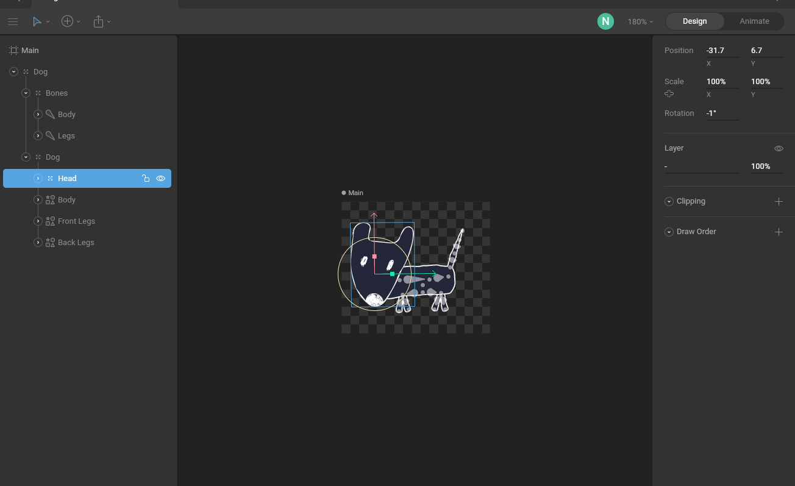
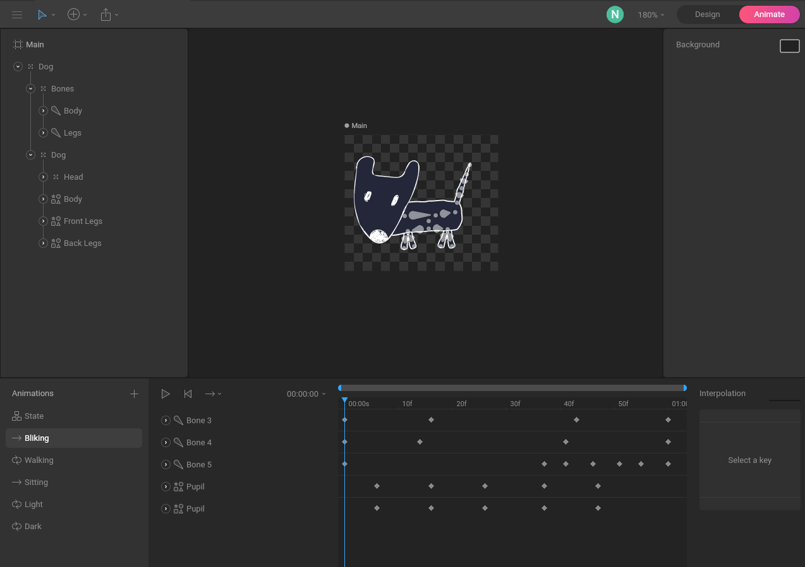
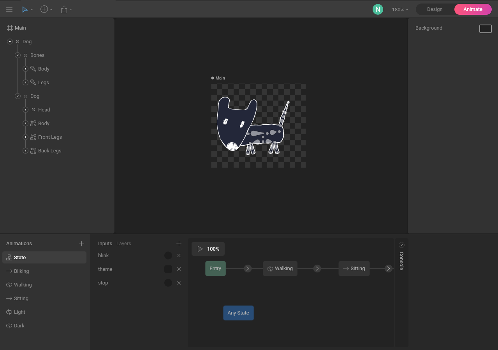

Welcome, in this article we will cover one of my favorite subjets, animations.Well a tool that makes possible to make interactive animations for web.

## Intro
Animation, more specific a motion graphics and design, defined a larged part of my life. Before web development, I worked many years in video production and large part of job was creating different animated graphics.

 
<YoutubeBlock videoId={"_KQ8aFCzSDI"} />
 

For that we used mostly [After Effects](https://www.adobe.com/products/aftereffects.html), which is defacto industry standard for [motion graphics](https://www.adobe.com/products/aftereffects/motion-graphics.html?promoid=L7NVTR46&mv=other) and [visual effects](https://www.adobe.com/products/aftereffects/vfx-visual-effects.html). And to this day it remains one of my favorite tools.

 
<YoutubeBlock videoId={"cR-tsqBJlBs"} />
 
 

## Yarn start

After diving into web developement, love for animation stayed. I tryed different technologies which enables you to add them to web, from [SMIL](https://developer.mozilla.org/en-US/docs/Web/SVG/SVG_animation_with_SMIL), which is now deprecated, to [GSAP](https://greensock.com/gsap/) and [AnimeJS](https://animejs.com/). They are geared towards developers, so if you would like to create a banner or some motion in website, with prepared design and assets these are good quick choices. Though for that and even more, in general for animation in code I would recomend combination of [SVG](https://developer.mozilla.org/en-US/docs/Web/SVG) and [Svelte](https://svelte.dev/), a really fun way to move the web with code. More on that you can read in these [articles](https://www.tihomir-selak.from.hr/category/svelte), where I covered them in more detail.

### Lottie

Though all of these tools above are not very helpfull in the process of design. When you are in the process of creating. So the process was, designers were creating animations in After effects and exporting in video format for us to implement, so it was double work. After a while we discovered [Lottie](https://airbnb.design/lottie/), which was opened sourced by Airbnb. How it works is that you have [Bodimovin](https://aescripts.com/bodymovin/), a free plugin for After Effects, and runtime implementation for different platforms. You create animation in After Effects and export it in [JSON](https://www.json.org/json-en.html) format, then refrence that file with lottie [runtime library](https://airbnb.design/lottie/#get-started) and voila, a magic.

<DataBlock render={({file}) => () => <LottieBlock data={file} autoplay={true} />} name="world" />

Now that was really impresive, you can use After Effects to create animations for web or mobile. Lottie do not support every feature of After Effects, as that would not be possible. You need to use shapes and create vector animations, but still that was a start of motion graphics for web. Now that sounds impressive, there are some drawbacks. Basically how lottie works is, it exports every frame from timeline in svg format, in paths, shapes and points. Basically you have svg player on the web, it can be interactive though it is still a player, and you need to use hacks to show interactivity. There is also one more drawback, as it exports every frame, files can be bigger. They are not comparable to sizes of other formats, like images, but they have to be parsed so there is a room for an improvement in that area. Also After Effects, is quite on a pricey side, after all it is industry standard for a reason. But if you need it only for web, and you do not need other tools from [Adobe](https://www.adobe.com/), surely we can find a better solution. 

  <DataBlock render={({file}) => () => <LottieBlock data={file} autoplay={true} />} name="sherlock" />

### The search continues

Now even before web days, I was searching for alternative to After Effects, but never could quite find it. There were some alternatives like  [Motion](https://www.apple.com/final-cut-pro/motion/) from Apple, but they were lacking a lot of features comparing to After Effects. [Blender](https://www.blender.org/) was another solution. It is also one of my favorite open source tools, and it has a plugin for [Lottie](https://gitlab.com/Tihi321/python-lottie) to which I contribted with my limited knowledge on Blender Python API. Though Blender is 3d software, and even with awesome 2d drawing suite in Greace Pencil it is not really suited for making animations for web.

## Rive

Finally I stumbled onto Flare, which was the first verion of Rive. It still availabe, but you are no longer able to register for Flare, it is there for transition period. It had the same core features as now Rive, it is web application, combination of [Figma](https://www.figma.com/) a design tool and [Animate](https://www.adobe.com/products/animate.html) layer based animation tool. It has all features needed to desing and animate, along with runtimes for web and mobile as with Lottie. That was a bingo, it ticked all the boxes, and it is free. The pricing is similar to Figma, as that it is focused on collaboration and teams.

Now [Rive](https://rive.app/) has arived, it is in beta, but it ready for testing. In the rest of the article, we will explore how it can be used, and what are caveats of using it from design to deployment.

### Runtime

Just like a Lottie, Rive has a different runtimes, implementation for different platforms to showcase animation exported from web app. From [web](https://github.com/rive-app/rive-wasm), [IOS](https://github.com/rive-app/rive-ios), [Android](https://github.com/rive-app/rive-android), hybrid with [Flutter](https://github.com/rive-app/rive-flutter) to even different [comunity](https://help.rive.app/runtimes/overview) implementations. Pretty much they covered it all. In fact last time Rive caugh my eye was when taking course in Flutter, as Rive is widely used for UI in mobile devices. But here we are covering web runtime. How does it stack against allready proven Lottie.

In these articles when covering any technology, I like to show a few examples. This blog in using [Gatsby](https://www.gatsbyjs.com/) which is really flexible and allows you to implement anything into post, as long as it runs on Javascript. And this particular one, needed 3 different implementation, [Youtube](https://tihi321.github.io/portfolio_2021/?path=/story/blocks-youtube--youtube), [Lottie](https://tihi321.github.io/portfolio_2021/?path=/story/blocks-lottie--world) and [Rive](https://tihi321.github.io/portfolio_2021/?path=/story/blocks-rive--dog), there were 3 more related to Gatsby so it can provide assets to Lottie and Rive, as Lottie uses json and rive uses .riv. All of the components are reusable for later use if needed.

In case of Rive, Rive is in beta, and one of the issues with new technology is that you can expect a lot of bugs. So when adding runtime component, first I tryed to see if there is allready premade implementation fior [React Framework](https://reactjs.org/). The ones that I found were not updated, so it was worth to create it instead, this will allow easier updating on any changes in runtime.

Implementation, went as smooth as it could be, considering that we are working with beta product. There were hickups, mostly related to package not working as it should with typescript and the lack of documentation. Nothing that diving to git code does not solve. Couple of issues were fixed with update after a few days, one remained related to Gasby, Node and Browser, though runtime is frequently updated so I can expect, that one to resolved also. But they have also runtime in [WebAsembly](https://webassembly.org/), who knows maybe it will worth a try to use that insead. Their API allows code a lot more influence over animation, compared to Lottie. For example you can pass, different animation names and states, you can start them on different events.

It has standard ones like autoplay and loop, so it is nice for loaders.

<AssetsBlock render={({file}) => () => <RiveBlock src={file.publicURL} autoplay={true} />} name="loader" />

You can also control animation with mouse, as in the case below, you can start and pause animation with mouse click

<AssetsBlock render={({file}) => () => <RiveBlock src={file.publicURL} commands={true} pause={true} />} name="loader" />

You add support for different states to animation, and pass them though code, you can check example on [homepage](https://www.tihomir-selak.from.hr/), you can pet the dog on mouse click, that animation has 3 state or cycles, walking, sitting and petting. As metions petting is connected to click event, while sitting start when css animation of moving dog from right to left ends, then walking cycle ends and sitting begins. So we can see that through code we exchaged 3 cycles in aniamtion. There is also one more state connected to theme, or switching of colors. You can more easy see connection on [Rive Block](https://tihi321.github.io/portfolio_2021/?path=/story/blocks-rive--dog) example.

### Design

Having a dedicated design software, integrated along with animating tool, it certanly helps. It is vector design tool like Figma. It lacks somewhat behind in terms of fatures. But it has some animation specific tools not available on other software. It has supoort bones. Aslo group system in my opinion is a lot more intuitive than in Figma. So it is a case of win some lose some. I would recommend of using both tools, as each is better at specific area. Figma for design and Rive for animation and correction. They do mention how to import from different software so importing is as easy as possible. They have very good [documentation](https://help.rive.app/) accompanied with video that explains how different tools work, highly recoomend before diving into tool. For example dog on homepage, was made in [Procreate](https://procreate.art/), traced with [Adobe Capture](https://www.adobe.com/products/capture.html), prepared in Figma and finaly animated in Rive.

It is worth also to mention, that not all features are supportd as of now from old verion of Flare, some of them will be implemented and some are not planned as they are replaced with different ones. Example at this moment desing tools only supports vector graphics like svg, it is not possible to import raster images like png and jpeg.

All support list of missing features can be found [here](https://help.rive.app/getting-started/faq-1/importing-rive-1-files)

### Animating

Now this part of Rive is most complete. Although it is not on par with After Effects in terms of features and easy of use. Aslo After Effects is 2.5d, it has support for Z axis, while Rive does not, though there are techinques for faking 3rd dimension. As a complete package it is hard to beat. Animation feature is really packed with options. You can connect different vertices and use weight on bones to deteremine the impact each bone will have on moving connected vartices. Timeline is similar to different animation software. It has basic features like keyframes, layers and everything related to speed and time. Timeline resembles one of After effects, it has even the same working area feature.

What is new and unique to Rive is state machine. This is easily one of the best features up until now. Basically what state machine allows is interactivity. You can create different animation cycles and connect them with state machine, which can be updated through code. You name different inputs, that can be boolean, number or trigger, then in code you can filter through all the inputs and find the name you want and run the input. They are not run the same way, so it allows for a lot of flexibility, basically with a number input you can have infinite number of states. Every state controls one or more animations, for example if input is number you can set 1 to be wallking cycle, 2 sit and 3 pet. Now in the code we can cycle through them. Multiple animations can be run at the same time, so mixing them can be really smooth. This is one of the core features, and I believe they will improve on it more in the future.

## Conclusion

First impression is, yep, it is awesome tool, fills the massive whole in the market. It is tool to allow animators animate the web. When developer gets animation it is just the case of trigering right one at the certain time, at certain event. It is up to developer to only connect logic. Each one is then master of its domain.

As they say on the [website](https://rive.app/), create and ship beautiful animations to any platform. You can quickly create unique loaders, without the need for css, up to creating complex motion graphics prevously tied exclusively to video. You can check the resources page for more [examples](https://rive.app/resources/).

Well enough for this time, hopefuly this has shown some of the things Rive can do, personaly I will continue to use it in the future. But it is time for a new challenge. In the next article I will explore [XR](https://en.wikipedia.org/wiki/Mixed_reality) for web, with [A-Frame](https://aframe.io/) and similar frameworks. So until next time happy coding.

