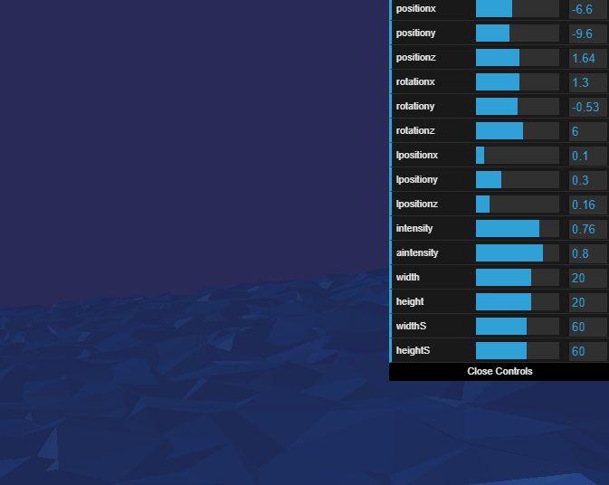
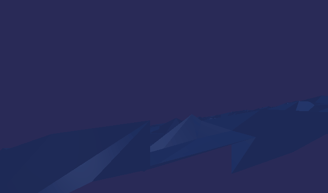
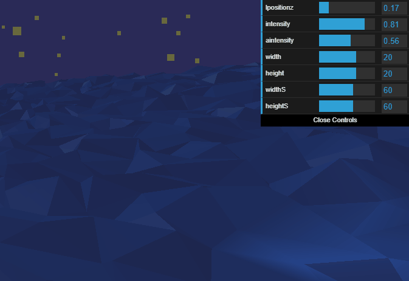
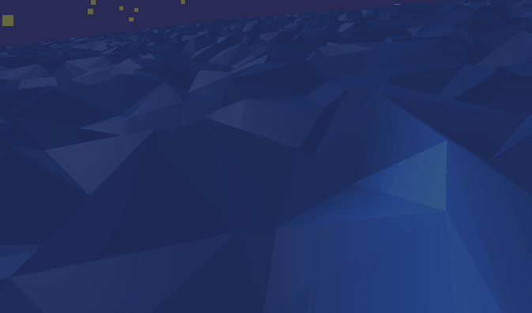

Welcome, in this 2 parter we will cover a bit of [threejs](https://threejs.org/) and [svelte](https://svelte.dev/). How to connect them in a custom slider.

## Intro

Before i start with a covering technologies, i would like to start a with a bit of self promotion. I entered into a next chapter in my businness life with opening a company called [Kobilica](https://www.kobilica.hr/). All will stay the same, but now i can offer my services directly to the customers. And as a first project with threejs, i just used company website. So if you will have the need for any of my services feel free to contact me, the info is on the website.

Ok, enough with shamless plug, now we can focus on meat of the article, threejs and svelte. This will be separated into 2 articles, and we will cover each of these technologies on its own, all whilte going through the code of [Kobilica](https://www.kobilica.hr/) website. This is first part where we will go through threejs.

## Threejs

### First contact

When researching [WebXR](https://developer.mozilla.org/en-US/docs/Web/API/WebXR_Device_API), and using [A-Frame](https://aframe.io/). I quickly realised that i might have bit more that i can chew. Basically i lacked the basics in technology that is at the core of the framwwork. So i desided to go back to the basics and learn how to use rendering engine.

### Alternatives

At the start i admit that i got a bit sidetracked. When researching threejs, there is a lot of comparisons with another rendering engine that works on the web, [Babylonjs](https://www.babylonjs.com/). An interesting part that caught my eye is that threejs and babylon are using different API to render graphics. Babylon uses [WebGPU](https://www.w3.org/TR/webgpu/), while three uses [WebGL](https://get.webgl.org/). Now it also states that WebGL is going to be deprecated, at that point i was undecided which is better choice to start with. Though in the end i just continued with threejs, and not only that but threejs has officialy started to work on it's own implementation of [WebGPU renderer](https://github.com/mrdoob/three.js/tree/dev/examples/jsm/renderers/webgpu). So although WebGPU is still long way from being supported, we can be assured that threejs will support it.

### Basics

Coming from frontend frameworks like React or Vue, i got used to virtual dom and rendering only when needed. It was a bit strange to understand, rendering engine that uses canvas element and render on each frame. Basically not having to worry about rerendering as it is happening regardless. Threejs is rendering engine that uses canvas and with help of browser's graphics card API adds image on the screen. Because it uses canvas and GPU it is more performant than updating DOM elements. That is why we don't have to worry about rerendering, we would start to worry if we have complex 3d geometry calculations, but here we are entering game developemnt teritory.
But more on that later, let's start with basic terminology for threejs and 3D in general.

### 3D

Three as name stands is for rendering 3d graphics in the web. So we would need to quickly cover some basic 3D terminology, through threejs. These next list of objects will be minimum what is needed for three to display something on the screen.

#### Renderer

Renderer is just technology that will be used to show somthing on the screen. In 3D software like [Blender](www.blender.org), you can use [Eeve](https://docs.blender.org/manual/en/latest/render/eevee/index.html) or [Cycles](https://docs.blender.org/manual/en/latest/render/cycles/index.html). In threejs, you just create Renderer class that it provides you. We will use WebGL renderer, define a size, pixel ratio and add it to html canvas element, to be able to display image.

```typescript
this.renderer = new WebGLRenderer({ alpha: true });
this.renderer.setSize(this.elementWidth, this.elementHeight);
this.renderer.setPixelRatio(devicePixelRatio);
this.appElement.appendChild(this.renderer.domElement);
```

In the code above, we are setting the size of rendere to parent elements width and height.This is not responsive, but you can set it at any time, as basically we are rerendering image in animation loop, and by adding event listener to window resize, we can set new values, and they will be taken into consideration on next frame.

#### Scene

In three like in [Blender](www.blender.org), we have at the start something that we call scene. Scene is just like in a movies, what we see, what is shown to the viewer. All objects that needs to be shown need to be part of the scene. And scene is rerendered on each frame, like a stop motion we move something on the scene and show that image to the viewer. Now if you do it 60 times per second it looks fluid. Tip. Scene in three, has a background and if you would like to remove it and show website background, you can set it to null.

```typescript
this.scene = new Scene();
this.scene.background = null;
```

#### Camera

Camera is object that is representing a window into the scene. What can been seen through the lens of the camera will become the image on the screen. Similarities between 3D and video never stop :-). In order for that camera to work it needs also to be part of the scene.

```typescript
this.camera = new PerspectiveCamera(75, this.elementWidth / this.elementHeight);
```

It accepts field of view, aspect ratio, and cut image far and near parameters. Also there is a lot more different cameras, in this example we are using perspective camera, as it is most common, it is camera with a view most natural to our eyes. Nice way to experiment how different values affect view, is to use Blender, and update parameters of the camera and see the action in real time. Also you can use gui that is available in the threejs, that will render sliders on the screen which you can connect to values of the camera.



Now camera when added to the scene, just like anything that is added to the sceen in threejs, is added to coordinates of x = 0, y = 0, Z = 0, which represents center of the scene. And if we add anything else to the scene it will be around camera. It will not be visible as camera will be inside of object. So we need to update position of the camera before adding to the screen.

```typescript
this.camera.position.z = 5;
this.camera.rotation.x = 90;
```

Camera object has position and rotation for all three axies. So in this case we are moving the camera, 5 units on z axis while rorating it around x axis 90 degrees.

#### Mesh

Mesh is any object that we want to display. Basically, mesh is 3d model, there are meshes with different kind of geomerties and textures. Gerometry are coordinates of vertices or the points that surround 3d model in 3d space. Textures are materials or colors that fill space, plane that is between vertices, without it we would not see anything as vertices are just coordinates and are infinitely small.

```typescript
const seaGeometry = new PlaneGeometry(
  worldObj.sea.width,
  worldObj.sea.height,
  worldObj.sea.widthS,
  worldObj.sea.heightS
);
const seaMaterial = new MeshPhongMaterial({
  side: DoubleSide,
  flatShading: FlatShading as boolean,
});
this.sea = new Mesh(seaGeometry, seaMaterial);
```

In example above we are creating sea 3d model. By adding a plane geometry, or flat service, which is provided to us by threejs. It receives 4 properties, width, height and segments for width and height. Segments mean how many ponint will plane have between 2 outer points that sorround the plane. The more segments, the more intensive will be for gpu, as it has more points to calculate in 3d space. There are a lot more different kind of geotries to present different shapes, like [Box](https://github.com/mrdoob/three.js/blob/dev/src/geometries/BoxGeometry.js) or [Cone](https://github.com/mrdoob/three.js/blob/dev/src/geometries/ConeGeometry.js) and full list can be checked on [github](https://github.com/mrdoob/three.js/tree/dev/src/geometries). On how to use them or in general threejs the i would recommend using the [docs](https://threejs.org/docs/index.html#manual/en/introduction/Creating-a-scene) in combination with installing types if sing with [Typescript](https://www.typescriptlang.org/). The same goes for material there are a lot of them which can be check on github, but for this example we used MeshPhongMaterial.

Before covering the first option, i need to explain how materials work and what side actually means. Materials are rendered on one side by default to save on resources, which means if you set camera to look at the flat object like a plane from one side it will show materials, but if you go around, material will be transparent. And lets say if we have any model that is not flat, like a box, camera can go around and material will be shown, but if you go inside a box it will be transparent as it will show other side of the plane that is between vertices that holds material. You can choose which side will be shown, which is called normal, or an angle from center of the object/geometry to center of the plane between vertices that show material.



Now in the example above we added double side as na options, so if camera goes around the plane, we can see materials, as this should represent the sea, if we go dicing we can see the surface. The second option is for color, should it be gradient orr flat, should plane between the vertices that show color have interpolation between different colors, or should it be flat color, so we see edges.

#### Lights

Now final thing, and one of the most important things in 3d is lighting. Light can make or break your 3d scene, just like in vodeo industry it is one of most crutial things. It sets the tone of the scene. But of course without any light scene is in the dark, camera don't see anything, and we need at least one light to reveal the world to the camera.

```typescript
this.ambientLight = new AmbientLight(0xffffff, world.ambientLight.aintensity);
this.scene.add(this.ambientLight);
```

Just like with all previous examples, threejs provides a lot of different light, and to know more about them you can check their docs, and [examples](https://threejs.org/examples/#webgl_animation_cloth). In the example above we are using ambient light, it most basic light that fills the whole scene equally. We usually add it as most basic and because it lights all equally, we can use it for presenting the sun, but to set the tone usually artist use a lot more then just one light to set the mood of the sceen. Lighting on it self is an art and there are artist that specialising in that.



#### Animation loop

Now that we have everything added to the scene, we need to make one important thing to animate it. Wee need to add animation loop, a function that will run on every animtino frame, and hopefullly run 60 frames per second, but that can depend on the system and intensity of animation.

```typescript
const animate = () => {
  requestAnimationFrame(animate);
  this.renderer.render();
  const position: TPostition = {
    x: random.x,
    y: random.y,
    z: random.z,
  };

  animatePlaneVertices(this.sea, this.frame);
};

animate();
```

In the example above we are calling recursively itself on each animation frame on first line of the function. And call renderer to render the scene again, and that is because on next line we are setting different position to each vertex of the plane, to make sea move.



### Conclusion

This is basically how threejs render, on each frame, as it is in canvas we do not need to worry about performace like we need to do with DOM elements. The full code for [Kobilica](https://www.kobilica.hr/), website that have the above implementation, can be viewed on [github](https://github.com/Tihi321/kobilica). In the next article we will cover DOM part of website how to use and connect Svelte with threejs canvas rendering. Until next time happy coding.
