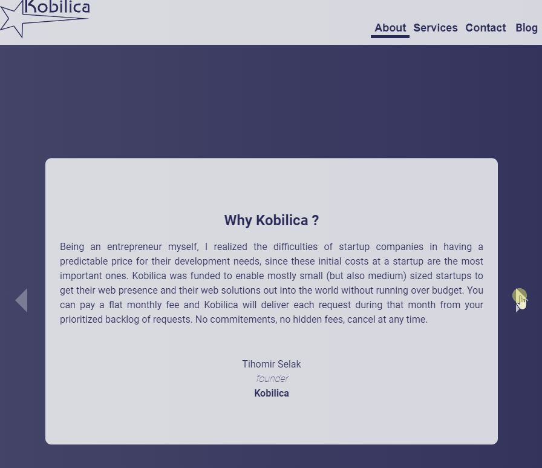
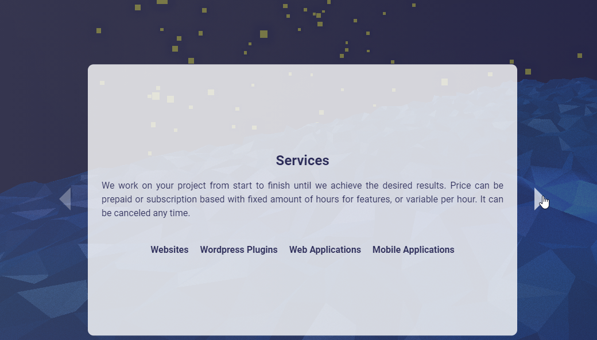

Welcome, to the second part of the 2 parts article about how to use [threejs](https://threejs.org/) with [svelte](https://svelte.dev/) through the code of [Kobilica](https://www.kobilica.hr/) website. In the [first article](https://www.tihomir-selak.from.hr/2021/three-times-a-charm/), we cover threejs. here we will cover svelte and how to connect and synchonize framework to work seamlessly with rendering engine.

## Intro

In the space of frontend frameworks, a fight for dominance is largely between [React](https://reactjs.org/), [VUE](https://vuejs.org/) or [Angular](https://angular.io/). It is a healthy fight between similar contestants that drive inovation forward. Each has it's own unique way of doing things, though they all are trying to tackle the same issues with the similar set of tools.

Svelte on the other hand, did not join that battle, it brought something different to the table. Svelte removed the need for [virtual DOM](https://svelte.dev/blog/virtual-dom-is-pure-overhead) and more importantly for me it removed the need for the including a framework along with the application. Application was created at compile time and all code was bundled togeather, it bundled only the code application needs so the code is really small. Svelte just like VUE has it own file type, and with it it's own custom compiler. At the begginging compiler was avaliable only with [rollup](https://rollupjs.org/guide/en/) bundler, now it practically everywhere. Svelte also at it's core uses a lot of native features from es6, and removed the support for legacy browsers, which as a result made code even smaller and faster.

Because of it's unique features, that differs from other frameworks, Svelte has found a lot of usecases where it excels. Example would be smart devices, where limitation in memory is significant, and using Svelte above other frameworks makes a lot of sense.

### History

The first time I heard about Svelte, and made a genuine interest in exploring it's pottential, is from my [Wordrpess](https://wordpress.org/) days. At that time [Gutenberg](https://wordpress.org/gutenberg/), the new block editor was introduced. As it uses React it made a lot of nose, as a lot of developers needed to learn new technoology to work with. Now Gutenberg is admin editor, and at the frontend Wordpress for rendering website still uses [PHP](https://www.php.net/). It also changed how the websites were build, it basically took [Components](https://reactjs.org/docs/components-and-props.html), and implemented that way of thinking into PHP, which in Wordpress worlds are called [Blocks](https://wordpress.org/support/article/blocks/).Block is nothing more than, 2 part component, one is on the admin side, and it needs to take information from user when creating post, and the other that will present that information on the website.

So on the admin side we used React, but on the frontend we did not have any framework at our disposal. On the fronend, we wanted to have bundle size small to be included, because of the speed. Which in turn men't it was hard to defend including React library for a menu or any other small part of the page. Specially as websites are not single page applications and they use a lot of different libraries allready. So any addition needs to be justified. But if you could have something that would allow you to create complex interfaces, and skip using html and vanilla js, without justification it would be nice :-). So that was the main benefit I saw in Svelte, and driving force behind using it.

### Fast forward

I am no longer Wordrpess developer, and don't have same issues to tackle. At the moment I work mainly with react, not even on the web. Still speed and small bundle size stay relevant. Reason behind Svelte in [Kobilica](https://www.kobilica.hr/), besides speed, without virtual DOM I dont have to worry about it as threejs has it's own renderer. Also in last couple of years I have been working with VUE and React, and was courius how would that translate to Svelte world.

## Svelte

Before you can start, for everything that is not vanilla js, you need to have a build process, setup a bundler to take care of that for you. Long gone are the days, where you had to add you own configuration, and setup everything. Where you needed to know [webpack](https://webpack.js.org/) and copy the config from last project and hope all works. With Svelte at the begginings, you needed to setup [rollup](https://rollupjs.org/) for all to work, add all plugins for different technologies that you want to use, and spend whole day making it. Now there are a lot of automated ways that create that configuration for you. You can also use [Parceljs](https://parceljs.org/) without configuration, and even older bundlers like webpack can now work out of the box for some projects. For this project I used [Vite](https://vitejs.dev/), which allows you through CLI to setup build really easy, in my case it was Svelte with Typescript support. I must say that I am really impressed at how easy it is to use typescript with Svelte, a long time it was not officialy supported, but from version 3 it has found a way into Svelte's world.

Now this is not Svelte tutarial, for that you can check Svlete's [interactive tutorial](https://svelte.dev/tutorial/basics), which i cannot praise high enough, on how it makes learning fun and easy. Here we will just go through some of different ideas that can be used in Svelte and how to connect it to threejs.

### Store

On [Kobilica](https://www.kobilica.hr/) as you can see there is a slider, and slider is connected to header.



That means that both of them share the same state. Svelte has a state management implmented out of the box. Nice simple state management, more that enough for this usecase. You can still use Redux/MobX with Svlete, but implemented store is more that good enough for smaller apps.

```typescript
import { writable } from "svelte/store";
export const slide = writable(0);
```

In the example above we can see how we can create a global store state. Just import writable and and initial value. Like VUE useData or React useState it gives you back object with different value. Well React gives back array, but that are implementation details. Object contains a few keys, like subscribe, set and update. with subscribe you get value from that store, with set and update you can update state with new values. There is also one other type of state along with writable, derived which behaves similar to VUEs useComputed, basically react to another state change, like selectors work in react redux. Subscribe is a function, which takes a callback that takes state values like an argument, but also it has shorthand to get value back if you use it HTML part directly, you can add dollar, like in PHP before variable, and it will use subscribe to get value

```svelte
<li class={$slide === Slides.About && "active"}>
  <button class="link" on:click={sendAbout}>About</button>
</li>
```

But you dont want to have all those setters and getters, duplicated across components, also if you could remove that logic from components and make it cleaner. There has to be a better way fo sharing logic.

### Hooks

Hooks in React are not new, and VUE from version 3 has implemented it's own version of hooks. As I got used to them, I really enjoyed working that way. It boosted my productivity, it allowed me to focus on task at hand by removing all bloat and leaving only important parts. With hooks it is easier to debug, as you can remove them one by one and see where the issue lies.

```typescript
import { slide } from "../store";
import { Slides } from "../constants";
export const useSlider = () => {

  const nextSlide = () => {
    slide.update((slideNumber) => (slideNumber >= 2 ? 0 : slideNumber + 1));
  };

  const prevSlide = () => {
    slide.update((slideNumber) => (slideNumber === 0 ? 2 : slideNumber - 1));
  };

  const setAbout = () => {
    slide.set(Slides.About);
  };

  const setServices = () => {
    slide.set(Slides.Services);
  };

  const setContact = () => {
    slide.set(Slides.Contact);
  };

  return {nextSlide, prevSlide, setAbout, setServices, setContact, slide}
```

In the example above, we can see how we can use this hook in both components and share the logic. Now state is share globaly because it is created globaly in another file. We can create encapsulated state simply by making the store inside of that hook.

```typescript
import { Slides } from "../constants";
import { writable } from "svelte/store"

export const useSlider = () => {
export const slide = writable(0);

const nextSlide = () => {
  slide.update((slideNumber) => (slideNumber >= 2 ? 0 : slideNumber + 1));
};

const prevSlide = () => {
  slide.update((slideNumber) => (slideNumber === 0 ? 2 : slideNumber - 1));
};

return {nextSlide, prevSlide, slide}
```

By creating slide inside of the hook, each components that uses that hook would have it's own state, and it could be used like setState in React. Now i am not saying that Svlete has a support for hooks, it does not. The real power of the hooks in React comes from being able to uses lifecycle hooks directly in them, like being able to use useEffect. In Svlete that is not possible, but also i am not sure there is great need for that here. But for our usecase was enough.

### Events

Now that slider is working, it still needs to connect it to threejs background, as when you mode slider background also moves.



Before, I go into details on how to connect, I would just like to show similarities and differences with how frameworks work in regards to that. VUE and Svelte unlike React, for passing data from child to parent are using events. React for that uses callbacks most of the time, if we are not using some king+d of global state. But difference between Svlete and VUE is, that Svelte is using native javascript CustomEvents, while VUE is using it own implementation of that, just like React VUE also like to have event handlers inside it's ows system. Not sure if that is related to because of Virtual DOM in both. But with native custom events, you can connect any part of the code through DOM elements. As all code supports it, this is what was used to connect Svelte with threejs part.

```typescript
const sendCameraForward = (element: HTMLElement) => {
  const event = new CustomEvent(Events.CameraForward);
  element.dispatchEvent(event);
};

const next = () => {
  nextSlide();
  sendCameraForward(backgroundElement);
};
```

From example you can see all that was done, on slider next, slider updated state and sent custom event to threejs to update it position. In three we have 3 possible possition, and because of header where we can go to any at any point in time with links. There we needed to tell threejs at which position to go.

```typescript
const sendCameraPostionThree = (element: HTMLElement) => {
  const event = new CustomEvent(Events.CameraPosition, {
    detail: CAMERA_POSITION_KEYS.THREE,
  });
  element.dispatchEvent(event);
};

function sendContact() {
  sendCameraPostionThree(backgroundElement);
  setContact();
}
```

From example above, we can see how we can pass data with custom events. Now data needs to be in key detail for all to work.

```typescript
onCameraPostion = (event: CustomEvent) => {
  switch (event.detail) {
    case CAMERA_POSITION_KEYS.ONE:
      this.cameraPosition = CAMERA_POSITION_KEYS.ONE;
      break;
    case CAMERA_POSITION_KEYS.TWO:
      this.cameraPosition = CAMERA_POSITION_KEYS.TWO;
      break;
    case CAMERA_POSITION_KEYS.THREE:
      this.cameraPosition = CAMERA_POSITION_KEYS.THREE;
      break;

    default:
      break;
  }
};

this.appElement.addEventListener(Events.CameraPosition, this.onCameraPostion);
```

In threejs class listens to onCameraPosition event and takes position number, updates position and on next animationFrame it animaties to that position


### Conclusion

If we can take anything from this article, is how powerfull CustomEvents can be, and you cab use it in situations where 2 different frameworks/libaraties need to communicate. Basically you can create state sharing with only events, but dont do that :-).

Hope you learned something from this article, and until next time happy coding.
